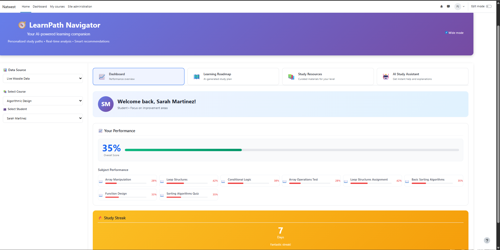

# 📬 NatWest Hack4aCause hackathon Project Submission


This repository was forked from [finos-labs/learnaix-h-2025](https://github.com/finos-labs/learnaix-h-2025).

---

## 📄 Summary of Your Solution (under 150 words)

**LearnPath Navigator** is an AI-powered Moodle plugin that revolutionizes personalized learning through intelligent roadmap generation and study resource recommendations.

**Problem**: Traditional LMS platforms provide generic learning paths that don't adapt to individual student performance, leading to inefficient learning and poor outcomes.

**Solution**: Our plugin analyzes student performance data and uses Snowflake's AI capabilities to generate personalized 3-step learning roadmaps with specific, actionable modules (e.g., "Complete 50 algebra problems") and curated study resources from platforms like Khan Academy, Desmos, and PhET. The system dynamically adapts to student weaknesses and provides targeted recommendations.

**Technologies**: Moodle Plugin Architecture, Snowflake Cortex AI, PHP, JavaScript, HTML5/CSS3, REST APIs, Khan Academy-inspired UI design.


## 🔍 Core Solution Features

- **Personalized Roadmaps**: AI assembles three actionable learning modules with goals, estimated effort, and embedded study materials for each student.
- **Dynamic Resources**: Curated Coursera, YouTube, and Khan Academy links refresh automatically for every roadmap iteration.
- **Live Gradebook Sync**: Direct integration with Moodle gradebook APIs keeps performance dashboards and AI prompts aligned with the latest quiz scores, assignment grades, and activity completions.
- **Sequential Mastery**: Modules unlock progressively as students mark items complete, reinforcing structured learning journeys.
- **Cortex-Powered Insights**: Snowflake Cortex AI delivers conversational coaching, study plans, and performance breakdowns inside the plugin.

## 👥 Team Information

| Field            | Details                               |
| ---------------- | ------------------------------------- |
| Team Name        | **delimiters**                        |
| Title            | **LearnPath Navigator**               |
| Theme            | AI-Powered Adaptive Learning Roadmaps |
| Contact Email    | prasukj123@gmail.com                  |
| Participants     | Aryan Dangwal, Prashuk Jain, Tuwshar Ahlawat |
| GitHub Usernames | @Aryan-Dangwal, @pj2566, @tusharahlawat, @decibol |

---

## 🎥 Submission Video

Demo video showcasing LearnPath Navigator's AI-powered personalized learning features.

- 📹 **Video Link**: [Video still pending - to be uploaded]

---

## 🌐 Hosted App / Solution URL

LearnPath Navigator is deployed as a Moodle plugin for live demonstration.

- 🌍 **Local Demo URL**: http://localhost/moodle/local/learnpath/
- 🌍 **Snowflake Deployment**: [Ready for cloud deployment]

---

## 📸 Screenshots

### Dashboard Overview

*AI-powered learning analytics dashboard with student performance overview*

### Personalized Learning Roadmap

*AI-generated 3-step learning modules with specific, actionable goals*

### Study Resource Recommendations

*Curated study materials from Khan Academy, Desmos, PhET, and other platforms*

---

## 🚀 Development Progress

**Current Status**: ✅ **COMPLETED - Ready for Submission**

### ✅ Completed Features
- [x] AI-powered learning roadmap generation (3 specific modules)
- [x] Personalized study resource recommendations (4 curated resources)
- [x] Student performance analytics and visualization
- [x] Khan Academy-inspired responsive UI design
- [x] Snowflake Cortex AI integration
- [x] Dynamic content parsing and display
- [x] Multi-subject support (Math, Science, English, Physics, etc.)
- [x] Real-time AI content generation
- [x] Moodle plugin architecture compliance

### 🎯 Key Achievements
- **Smart AI Prompting**: Engineered strict prompts for reliable, actionable content
- **Performance Analysis**: Identifies weak subjects (< 60%) and strong areas (> 75%)
- **Adaptive Learning**: Generates specific goals like "Complete 50 algebra problems"
- **Resource Matching**: AI recommends tools based on student's weak subjects

---

## 🛠️ Technical Architecture

**Plugin Type**: Moodle Local Plugin (PHP-based)  
**AI Integration**: Snowflake Cortex API  
**Frontend**: HTML5, CSS3 (Khan Academy styling), JavaScript ES6+  
**Backend**: PHP with Moodle Database API  
**Deployment**: Snowflake Cloud Platform Ready  
**Data Processing**: Real-time student performance analysis  

---

## 🏔️ Snowflake Configuration

### **Quick Setup for LearnAIx Platform**

#### **1. Create Snowflake Connection**
```sql
-- Execute in Snowflake console
CREATE CONNECTION LEARNAIX_CONNECTION
  TYPE = 'SNOWFLAKE'
  ACCOUNT = 'learnaix.snowflakecomputing.com'
  USER = 'learnaix_service'
  DATABASE = 'LEARNAIX_DB'
  SCHEMA = 'PUBLIC'
  WAREHOUSE = 'LEARNAIX_WH';
```

#### **2. Configure Plugin Settings**
```
Site Administration > Plugins > Local plugins > LearnPath Navigator

Snowflake CLI Path: /usr/local/bin/snow
Snowflake Connection: LEARNAIX_CONNECTION  
Snowflake Config Path: /opt/snowflake/config
AI Model: mistral-7b
Enable AI Features: ✓ Enabled
```

#### **3. Test AI Integration**
```bash
# Test Cortex API
snow sql -c LEARNAIX_CONNECTION -q "SELECT SNOWFLAKE.CORTEX.COMPLETE('mistral-7b', 'Test prompt') as response"
```

### **Environment Paths**

| Environment | CLI Path | Connection | Config Path |
|-------------|----------|------------|-------------|
| **Local Windows** | `C:\Program Files\Snowflake CLI\snow.exe` | `LEARNAIX_CONNECTION` | `C:\Users\%USERNAME%\AppData\Local\snowflake` |
| **Snowflake Cloud** | `/usr/local/bin/snow` | `LEARNAIX_CONNECTION` | `/opt/snowflake/config` |
| **Local Linux** | `/usr/local/bin/snow` | `LEARNAIX_CONNECTION` | `~/.snowflake` |

---

## License

Copyright 2025 FINOS

Distributed under the [Apache License, Version 2.0](http://www.apache.org/licenses/LICENSE-2.0).

SPDX-License-Identifier: [Apache-2.0](https://spdx.org/licenses/Apache-2.0)
